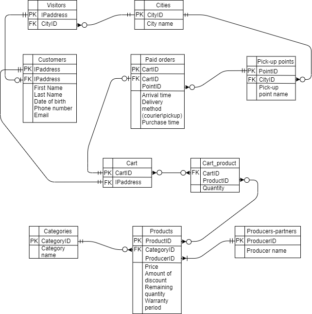

# ICT_FinalProjectDraft

**Zakir Marajapov;**

(all the cities, pick-up points, products, its categories and producers are included to their tables beforehand) 

When someone visits our site, our database automatically includes him or her to **'Visitors'** table and adds appropriate city ID. When a visitor decided to add a product to cart, the database also adds him or her to **'Customers'** table (now a person is recorded in 2 tables at the same time), receives the necessary data from the person and creates a new line in **'Cart'** table with person's IP address. **'Cart_product'** table, in turn, records what products the person added to cart. If the person has bought the products in the cart, the database adds the cart to **'Orders'** table. After that, the database gets the information about the delivery method and to what pick-up point it must be sent, records purchase time(in case we need to check whether the warranty was expired) and arrival time. Also, using functions, it makes sure that everything is filled in correctly and the data matches each other (otherwise, the order will probably be sent to the pick-up point from the totally different city).

